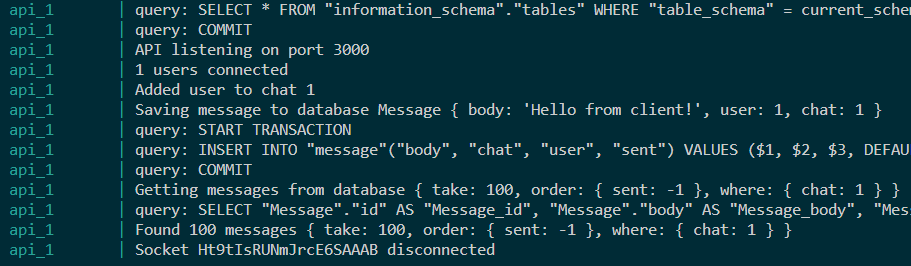
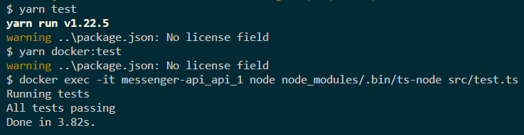
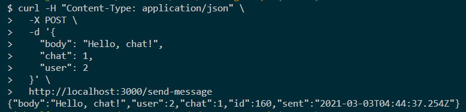
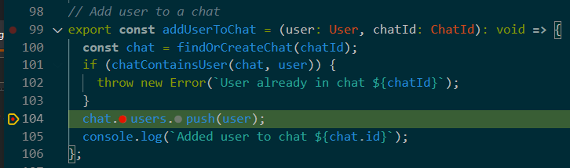
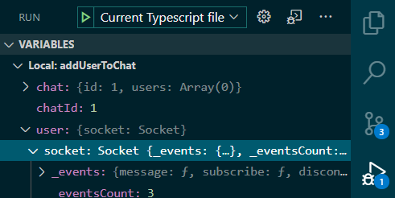
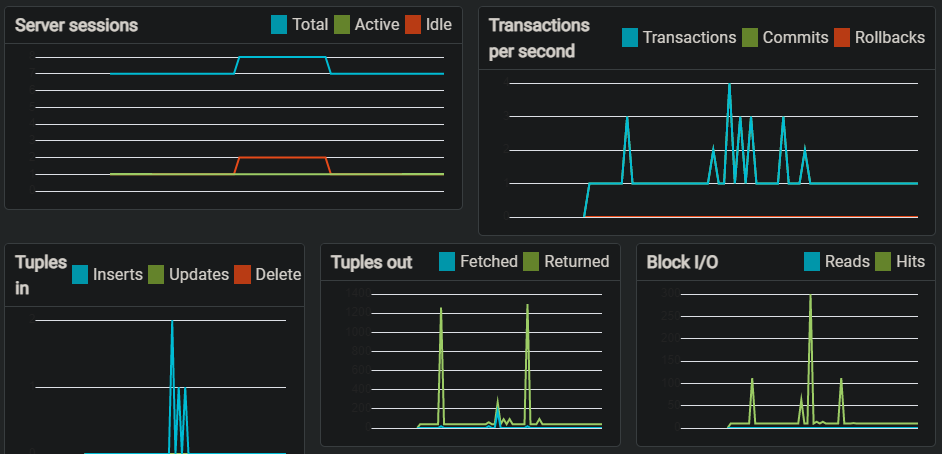
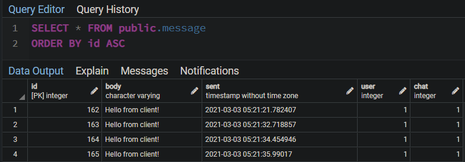

# Messenger API

A Chat API that allows users to send and receive text messages

## Features

- Send a text message to one or more recipients
- Get up to 100 messages for a given recipient
- Get up to 100 messages for a given sender

## Limitations

- No authentication/authorization/registration
- Messages can be spoofed
- Chats are not private

## Dependencies

- Docker
- Docker-compose
- Git
- Web browser
- CUrl (optional)
- Node.js (optional)
- Yarn (optional)

## Getting started

Clone the repository.

```bash
git clone git@github.com:mz3/messenger-api.git
```

Stop any PostgreSQL or other processes running on ports 3000, 3001, 3002, and 5432. Start the containers with `docker-compose`.

```bash
cd messenger-api
docker-compose up -d
```

Check the logs.

```bash
docker-compose logs
```



Run the test suite with Docker.

```bash
# Using Docker
docker exec -it messenger-api_api_1 node node_modules/.bin/ts-node src/test.ts

# Using Yarn alias (requires Node.js + Yarn)
yarn test
```



Send some requests with CUrl.

```bash
# Send a message to chat 1 from user 2
curl -H "Content-Type: application/json" \
  -X POST \
  -d '{
    "body": "Hello, chat!",
    "chat": 1,
    "user": 2
  }' \
  http://localhost:3000/send-message

# Get last 100 messages from all users
curl -H "Content-Type: application/json" \
  -X POST \
  http://localhost:3000/get-messages

# Get last 100 messages in chat 1
curl -H "Content-Type: application/json" \
  -X POST \
  -d '{
    "chat": 1
  }' \
  http://localhost:3000/get-messages

# Get last 100 messages sent by user 1
curl -H "Content-Type: application/json" \
  -X POST \
  -d '{
    "user": 1
  }' \
  http://localhost:3000/get-messages
```



## Local development environment

- For local development, installing the optional dependencies is required.
- VS Code is recomended for Typescript intellisense, automated formatting, and the Node.js debugger.

```bash
# Install NPM modules
yarn

# Start the docker containers
yarn start

# Start the Node.js API script. The script will remain open as the API listens on http://localhost:3001
yarn node:watch

# In a second terminal window, run the test suite. It will re-run tests on code changes and print results.
yarn node:test

# In a third terminal window, send a test message
curl -H "Content-Type: application/json" \
  -X POST \
  -d '{
    "body": "Hello, chat!",
    "chat": 1,
    "user": 2
  }' \
  http://localhost:3001/send-message
```

Make changes, save the Typescript file, and the API restarts, database tables rebuild, and test suite runs.

### Development URLs

- HTTP API (production mode): [http://localhost:3000](http://localhost:3000)
- HTTP API (development mode): [http://localhost:3001](http://localhost:3001)
- Database UI (pgAdmin): [http://localhost:3002](http://localhost:3002)

### Debugging Typescript code

Click to the left of line numbers to set breakpoints.



Press F5 (Windows) or go to the Debugger tab and click the Run button. Step through code and inspect local variables using the built-in VS Code debugger.



## Managing the database

### pgAdmin

Open [http://localhost:3002](http://localhost:3002) in a browser and enter the credentials.

- Username: `messenger@localhost`
- Password: `messenger`

Find "Browser" > "Servers" > "Add New Server". Enter the settings.

- General > Name: `Messenger`
- Connection > Host: `postgres`
- Connection > Port: `5432`
- Connection > Username: `messenger`
- Connection > Password: `messenger`
- Connection > Save password?: `true`

Click Messenger > Dashboard to monitor connections and queries.



Browser tables and run queries.



### psql

Connect to the database.

```bash
yarn psql
```

Enter PostgreSQL commands and queries.

```SQL
-- List tables
\dt

-- Describe message table
\d message

-- List messages (hit `q` to close output)
select * from message;

-- Delete a conversation (prints number of messages dropped)
delete from message where message.chat = 1;

-- Get a user's sent messages
select * from message where message.user = 1;

-- Disconnect from database
\q
```

Enable the SQL query logger in `ormconfig.json`.

```json
{
  "logging": true
}
```

## Notes

- See `"scripts"` property in `package.json` for full Yarn script reference.
- To get a shell inside the Docker container, run:

```bash
docker exec -it messenger-api_messenger-api sh
```
