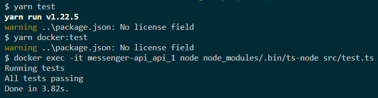
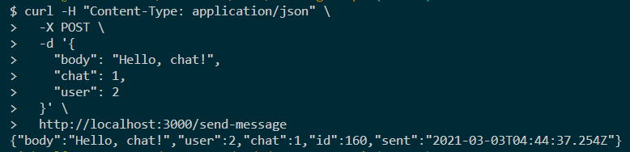
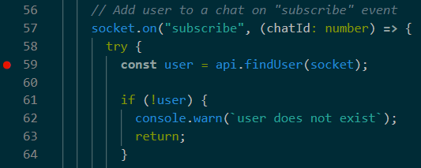
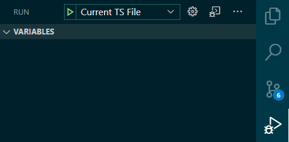

# Messenger API

A messenger API that allows users to send and receive chat messages

## Features

- Send a text message to one or more recipients
- Get up to 100 messages for a given recipient
- Get up to 100 messages for a given sender

## Dependencies

- Docker
- Docker-compose
- CUrl (optional)
- Node.js (optional)
- Web browser (optional)
- Yarn (optional)

## Getting started

Clone the repository.

```bash
git clone git@github.com:mz3/messenger-api.git
```

Stop any PostgreSQL or other processes running on ports 3000, 3001, 3002, and 5432. Start the containers with `docker-compose`.

```bash
cd messenger-api
docker-compose up -d
```

Run the test suite.

```bash
# Using Docker
docker exec -it messenger-api_api_1 node node_modules/.bin/ts-node src/test.ts

# Using Yarn script alias (requires Node.js + Yarn)
yarn test
```



Send some requests with `curl`.

```bash
# Send a message to chat 1 from user 2
curl -H "Content-Type: application/json" \
  -X POST \
  -d '{
    "body": "Hello, chat!",
    "chat": 1,
    "user": 2
  }' \
  http://localhost:3000/send-message

# Get last 100 messages from all users
curl -H "Content-Type: application/json" \
  -X POST \
  http://localhost:3000/get-messages

# Get last 100 messages in chat 1
curl -H "Content-Type: application/json" \
  -X POST \
  -d '{
    "chat": 1
  }' \
  http://localhost:3000/get-messages

# Get last 100 messages sent by user 1
curl -H "Content-Type: application/json" \
  -X POST \
  -d '{
    "user": 1
  }' \
  http://localhost:3000/get-messages
```



## Developing

For local development, the optional dependencies are required.

### Environment

- Docker
- Testing
- Typescript
- VS Code

### Installation

```bash
# Install NPM modules
yarn

# Start the docker containers
yarn start

# Start the Node.js API script. The script will remain open as the API listens on http://localhost:3001
yarn node:watch

# In a second terminal window, run the test suite. It will re-run tests on code changes and print results.
yarn node:test

# In a third terminal window, send a test message
curl -H "Content-Type: application/json" \
  -X POST \
  -d '{
    "body": "Hello, chat!",
    "chat": 1,
    "user": 2
  }' \
  http://localhost:3001/send-message
```

Make code changes, and watch as the API restarts, database tables rebuild, and test suite runs.

### Endpoints

- HTTP API (production mode): [http://localhost:3000](http://localhost:3000)
- HTTP API (development mode): [http://localhost:3001](http://localhost:3001)
- Database UI (pgAdmin): [http://localhost:3002](http://localhost:3002)

### Debugger

Click to the left of line numbers to set breakpoints.



With a Typescript file open, Go to the Debugger tab and click the Run button.



### Database

To login to the database UI, enter the credentials.

- Username: `messenger@localhost`
- Password: `messenger`

After logging in, add the messenger database connection parameters.

- Connection type: PostgreSQL
- Database name: `messenger`
- Username: `messenger`
- Password: `messenger`

To connect to psql, run:

```bash
yarn psql
```

A query logger can be enabled in `ormconfig.json`.

```json
{
  "logging": true
}
```

## Limitations

- Clients must use server timezone
- No authentication or sessions
- Messages can be spoofed
- Messages are not private
- Users are not persisted across restarts

## Notes

- See `"scripts"` property in `package.json` for full Yarn script reference.
- To get a shell inside the Docker container, run:

```bash
docker exec -it messenger-api_messenger-api sh
```
